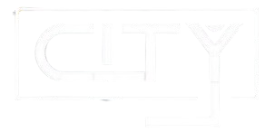

# Web City SDC (En desarrollo)

## Descripción
Este proyecto es el sitio web oficial de City SDC, un bar único en Santiago de Compostela. Actualmente en desarrollo, pronto ofrecerá una experiencia digital que refleja la atmósfera vibrante y acogedora de nuestro establecimiento.

## Autores
- Desarrollador: [Blancoo06](https://github.com/Blancoo06)
- Propietarios: Bruno y Diogo

## Estado del Proyecto
🚧 En construcción 🚧

Estamos trabajando arduamente para traerte la mejor experiencia online. ¡Mantente atento para futuras actualizaciones!

## Contacto
Para más información, visítanos en City SDC o espera nuestras próximas actualizaciones en línea.

---
© 2024 City SDC - Todos los derechos reservados
